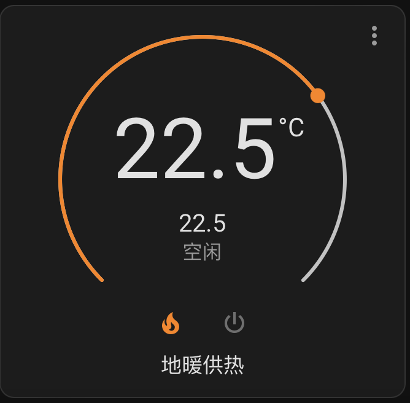

# VSmart

[![GitHub Release][releases-shield]][releases]
[![GitHub Activity][commits-shield]][commits]
[![License][license-shield]](LICENSE)
[![hacs][hacsbadge]][hacs]

这个组件从<a href="https://github.com/cdpuk/ha-bestway">BestWay</a>组件改造而来，支持威能壁挂炉通过威精灵VSmart Pro温控器接入HA，可以控制地暖温度和生活热水温度，还可以查看当前水温，威能API返回的数据比较多，更多的数据集成等我有空再说，也欢迎大家提PR。

  
  

## 设备与账号

你需要确定你使用的是威能威精灵VSmart Pro温控器，下载并安装<a href="https://apps.apple.com/cn/app/威管家/id1465568192">威管家</a>(iOS)或者威能+(Android)，并注册账号。请注意，如果你使用中国手机号注册账号，在HA集成的配置过程中，用户名请输入 +86手机号 (前缀必须有+86)，API Location选择 CN ，才能顺利登录。其他国家的威能API需要有当地用户帮忙抓包。

## Installation

This integration is delivered as a HACS custom repository.

1. Download and install [HACS][hacs-download].
2. Add a [custom repository][hacs-custom] in HACS. You will need to enter the URL of this repository when prompted: `https://github.com/HateBaozi/ha-vaillant-vsmart-cn`.

## Configuration

Ensure you can control your device using the VSmart mobile app. At time of writing, there was also a Lay-Z-Spa branded app, but despite this being the recommended app in the installation manual, the spa could not be added. The VSmart app worked flawlessly.

* Go to **Configuration** > **Devices & Services** > **Add Integration**, then find **VSmart** in the list.
* Enter your VSmart username and password when prompted.

## Update speed

Any changes made to the spa settings via the VSmart app or physical controls can take a short amount of time to be reflected in Home Assistant. This delay is typically under 30 seconds, but can sometimes extend to a few minutes.

## Improvement ideas

Achieve faster (or even local) updates.
* Capture more traffic from the mobile app to work out how it receives updates so quickly.
* The integration currently has to poll, but the mobile app is able to reflect changes based on physical button presses on the Spa within a fraction of a second.
* A brief recent attempt suggested that the Android app may have certificate pinning enabled, making this slightly harder than expected. Perhaps decompilation is an easier route.
* We know the spa talks directly to the cloud using MQTT. Traffic captures against the Android app appeared to show only HTTPS traffic.

## Acknowledgements

* https://github.com/B-Hartley/bruces_homeassistant_config
* https://github.com/cdpuk/ha-bestway

## Contributing

If you want to contribute to this please read the [Contribution Guidelines](CONTRIBUTING.md).

[commits-shield]: https://img.shields.io/github/commit-activity/y/cdpuk/ha-vsmart.svg?style=for-the-badge
[commits]: https://github.com/cdpuk/ha-vsmart/commits/main
[hacs]: https://github.com/custom-components/hacs
[hacsbadge]: https://img.shields.io/badge/HACS-Custom-orange.svg?style=for-the-badge
[license-shield]: https://img.shields.io/github/license/cdpuk/ha-vsmart.svg?style=for-the-badge
[releases-shield]: https://img.shields.io/github/release/cdpuk/ha-vsmart.svg?style=for-the-badge
[releases]: https://github.com/cdpuk/ha-vsmart/releases
[hacs-download]: https://hacs.xyz/docs/setup/download
[hacs-custom]: https://hacs.xyz/docs/faq/custom_repositories
[vsmart-android]: https://play.google.com/store/apps/details?id=com.layzspa.smartHome
[vsmart-ios]: https://apps.apple.com/us/app/vsmart-smart-hub/id1456731336

#威能VSmart API和控制命令参考
<a href="https://docs.gizwits.com/en-us/cloud/OpenAPI.html#Overview">机制云开放平台</a>
<code>
{
    "name": "vSmartPro",
    "entities": [
        {
            "id": 0,
            "display_name": "机智云开发套件",
            "attrs": [
                {
                    "display_name": "循环功能使能开关",
                    "name": "Circulation_Enable",
                    "data_type": "bool",
                    "position": {
                        "bit_offset": 0,
                        "len": 1,
                        "unit": "bit",
                        "byte_offset": 0
                    },
                    "type": "status_writable",
                    "id": 0,
                    "desc": "0: off 1: on"
                },
                {
                    "display_name": "加热使能开关",
                    "name": "Heating_Enable",
                    "data_type": "bool",
                    "position": {
                        "bit_offset": 0,
                        "len": 1,
                        "unit": "bit",
                        "byte_offset": 0
                    },
                    "type": "status_writable",
                    "id": 1,
                    "desc": "0: off 1: on  集中供暖"
                },
                {
                    "display_name": "生活热水使能开关",
                    "name": "WarmStar_Tank_Loading_Enable",
                    "data_type": "bool",
                    "position": {
                        "bit_offset": 0,
                        "len": 1,
                        "unit": "bit",
                        "byte_offset": 0
                    },
                    "type": "status_writable",
                    "id": 2,
                    "desc": "0: off 1: on\n水罐加热"
                },
                {
                    "display_name": "加热是否使能(Boiler)",
                    "name": "Enabled_Heating",
                    "data_type": "bool",
                    "position": {
                        "bit_offset": 0,
                        "len": 1,
                        "unit": "bit",
                        "byte_offset": 0
                    },
                    "type": "status_readonly",
                    "id": 3,
                    "desc": ""
                },
                {
                    "display_name": "生活热水是否使能(Boiler)",
                    "name": "Enabled_DHW",
                    "data_type": "bool",
                    "position": {
                        "bit_offset": 0,
                        "len": 1,
                        "unit": "bit",
                        "byte_offset": 0
                    },
                    "type": "status_readonly",
                    "id": 4,
                    "desc": ""
                },
                {
                    "display_name": "BMU_Platform",
                    "name": "BMU_Platform",
                    "data_type": "bool",
                    "position": {
                        "bit_offset": 0,
                        "len": 1,
                        "unit": "bit",
                        "byte_offset": 0
                    },
                    "type": "status_writable",
                    "id": 5,
                    "desc": "0: not \"CoC2011 Platform\", 1: \"CoC2011 Platform\""
                },
                {
                    "display_name": "温度补偿",
                    "name": "Weather_compensation",
                    "data_type": "bool",
                    "position": {
                        "bit_offset": 0,
                        "len": 1,
                        "unit": "bit",
                        "byte_offset": 0
                    },
                    "type": "status_writable",
                    "id": 6,
                    "desc": "0: off 1: on"
                },
                {
                    "display_name": "CH模式设置",
                    "name": "Mode_Setting_CH",
                    "data_type": "enum",
                    "enum": [
                        "Auto",
                        "Cruising"
                    ],
                    "position": {
                        "bit_offset": 0,
                        "len": 1,
                        "unit": "bit",
                        "byte_offset": 0
                    },
                    "type": "status_writable",
                    "id": 7,
                    "desc": "温控器模式供暖设置，auto是定时，cruising是全天候."
                },
                {
                    "display_name": "DHW模式设置",
                    "name": "Mode_Setting_DHW",
                    "data_type": "enum",
                    "enum": [
                        "Auto",
                        "Cruising"
                    ],
                    "position": {
                        "bit_offset": 0,
                        "len": 1,
                        "unit": "bit",
                        "byte_offset": 0
                    },
                    "type": "status_writable",
                    "id": 8,
                    "desc": "生活热水模式设置，auto是定时，cruising是全天候"
                },
                {
                    "display_name": "DHW功能选择",
                    "name": "DHW_Function",
                    "data_type": "enum",
                    "enum": [
                        "warmstart",
                        "tank_loading",
                        "none",
                        "not_setted"
                    ],
                    "position": {
                        "bit_offset": 0,
                        "len": 2,
                        "unit": "bit",
                        "byte_offset": 0
                    },
                    "type": "status_writable",
                    "id": 9,
                    "desc": "配网完成时使用，选择DHW的功能；\n0是热启动（已去掉）\n1是水箱负载；\n2是仅生活热水；"
                },
                {
                    "display_name": "加热设置",
                    "name": "Heating_System_Setting",
                    "data_type": "enum",
                    "enum": [
                        "floor_heating",
                        "radiator",
                        "not_setted"
                    ],
                    "position": {
                        "bit_offset": 0,
                        "len": 2,
                        "unit": "bit",
                        "byte_offset": 0
                    },
                    "type": "status_writable",
                    "id": 10,
                    "desc": "floor_heating是地暖；\nradiator是散热器"
                },
                {
                    "display_name": "TimeSlot类型",
                    "name": "Time_slot_type",
                    "data_type": "enum",
                    "enum": [
                        "CH",
                        "DHW"
                    ],
                    "position": {
                        "bit_offset": 0,
                        "len": 1,
                        "unit": "bit",
                        "byte_offset": 0
                    },
                    "type": "status_writable",
                    "id": 11,
                    "desc": ""
                },
                {
                    "display_name": "品牌信息",
                    "name": "Brand",
                    "data_type": "enum",
                    "enum": [
                        "default",
                        "vaillant on desk",
                        "protherm on desk",
                        "vaillant in wall",
                        "protherm in wall",
                        "vaillant TR",
                        "DD TR"
                    ],
                    "position": {
                        "bit_offset": 0,
                        "len": 3,
                        "unit": "bit",
                        "byte_offset": 0
                    },
                    "type": "status_readonly",
                    "id": 12,
                    "desc": ""
                },
                {
                    "display_name": "加热曲线参数",
                    "name": "Heating_Curve",
                    "data_type": "uint8",
                    "position": {
                        "bit_offset": 0,
                        "len": 1,
                        "unit": "byte",
                        "byte_offset": 0
                    },
                    "uint_spec": {
                        "addition": 0,
                        "max": 100,
                        "ratio": 0.1,
                        "min": 0
                    },
                    "type": "status_writable",
                    "id": 13,
                    "desc": ""
                },
                {
                    "display_name": "TimeSlot最多可写个数(DHW)",
                    "name": "Max_NumBer_Of_Timeslots_DHW",
                    "data_type": "uint8",
                    "position": {
                        "bit_offset": 0,
                        "len": 1,
                        "unit": "byte",
                        "byte_offset": 0
                    },
                    "uint_spec": {
                        "addition": 0,
                        "max": 5,
                        "ratio": 1,
                        "min": 0
                    },
                    "type": "status_readonly",
                    "id": 14,
                    "desc": ""
                },
                {
                    "display_name": "当前需要被写的TimeSlot(DHW)",
                    "name": "Slot_current_DHW",
                    "data_type": "uint8",
                    "position": {
                        "bit_offset": 0,
                        "len": 1,
                        "unit": "byte",
                        "byte_offset": 0
                    },
                    "uint_spec": {
                        "addition": 0,
                        "max": 5,
                        "ratio": 1,
                        "min": 0
                    },
                    "type": "status_writable",
                    "id": 15,
                    "desc": ""
                },
                {
                    "display_name": "TimeSlot最多可写个数(CH)",
                    "name": "Max_NumBer_Of_Timeslots_CH",
                    "data_type": "uint8",
                    "position": {
                        "bit_offset": 0,
                        "len": 1,
                        "unit": "byte",
                        "byte_offset": 0
                    },
                    "uint_spec": {
                        "addition": 0,
                        "max": 5,
                        "ratio": 1,
                        "min": 0
                    },
                    "type": "status_readonly",
                    "id": 16,
                    "desc": ""
                },
                {
                    "display_name": "当前需要被写的TimeSlot(CH)",
                    "name": "Slot_current_CH",
                    "data_type": "uint8",
                    "position": {
                        "bit_offset": 0,
                        "len": 1,
                        "unit": "byte",
                        "byte_offset": 0
                    },
                    "uint_spec": {
                        "addition": 0,
                        "max": 5,
                        "ratio": 1,
                        "min": 0
                    },
                    "type": "status_writable",
                    "id": 17,
                    "desc": ""
                },
                {
                    "display_name": "室内设定温度1(舒适)",
                    "name": "Room_Temperature_Setpoint_Comfort",
                    "data_type": "uint8",
                    "position": {
                        "bit_offset": 0,
                        "len": 1,
                        "unit": "byte",
                        "byte_offset": 0
                    },
                    "uint_spec": {
                        "addition": 5,
                        "max": 50,
                        "ratio": 0.5,
                        "min": 0
                    },
                    "type": "status_writable",
                    "id": 18,
                    "desc": "Default: 20°C,range: 5-30°C,unit:°C,resolution:0.5°C.It is used for Auto Mode and Time slot1,2,3."
                },
                {
                    "display_name": "室内设定温度2(节能)",
                    "name": "Room_Temperature_Setpoint_ECO",
                    "data_type": "uint8",
                    "position": {
                        "bit_offset": 0,
                        "len": 1,
                        "unit": "byte",
                        "byte_offset": 0
                    },
                    "uint_spec": {
                        "addition": 5,
                        "max": 50,
                        "ratio": 0.5,
                        "min": 0
                    },
                    "type": "status_writable",
                    "id": 19,
                    "desc": "Default: 15°C,range: 5-30°C,unit:°C,resolution:0.5°C.It is used for Night."
                },
                {
                    "display_name": "室外温度",
                    "name": "Outdoor_Temperature",
                    "data_type": "uint8",
                    "position": {
                        "bit_offset": 0,
                        "len": 1,
                        "unit": "byte",
                        "byte_offset": 0
                    },
                    "uint_spec": {
                        "addition": -50,
                        "max": 99,
                        "ratio": 1,
                        "min": 0
                    },
                    "type": "status_writable",
                    "id": 20,
                    "desc": "通过第三方天气接口传输"
                },
                {
                    "display_name": "室内实际温度",
                    "name": "Room_Temperature",
                    "data_type": "uint8",
                    "position": {
                        "bit_offset": 0,
                        "len": 1,
                        "unit": "byte",
                        "byte_offset": 0
                    },
                    "uint_spec": {
                        "addition": -50,
                        "max": 198,
                        "ratio": 0.5,
                        "min": 0
                    },
                    "type": "status_readonly",
                    "id": 21,
                    "desc": ""
                },
                {
                    "display_name": "生活热水设定温度",
                    "name": "DHW_setpoint",
                    "data_type": "uint8",
                    "position": {
                        "bit_offset": 0,
                        "len": 1,
                        "unit": "byte",
                        "byte_offset": 0
                    },
                    "uint_spec": {
                        "addition": 35,
                        "max": 60,
                        "ratio": 0.5,
                        "min": 0
                    },
                    "type": "status_writable",
                    "id": 22,
                    "desc": ""
                },
                {
                    "display_name": "供热设定温度下限",
                    "name": "Lower_Limitation_of_CH_Setpoint",
                    "data_type": "uint8",
                    "position": {
                        "bit_offset": 0,
                        "len": 1,
                        "unit": "byte",
                        "byte_offset": 0
                    },
                    "uint_spec": {
                        "addition": 0,
                        "max": 200,
                        "ratio": 0.5,
                        "min": 0
                    },
                    "type": "status_readonly",
                    "id": 23,
                    "desc": ""
                },
                {
                    "display_name": "供热设定温度上限",
                    "name": "Upper_Limitation_of_CH_Setpoint",
                    "data_type": "uint8",
                    "position": {
                        "bit_offset": 0,
                        "len": 1,
                        "unit": "byte",
                        "byte_offset": 0
                    },
                    "uint_spec": {
                        "addition": 0,
                        "max": 200,
                        "ratio": 0.5,
                        "min": 0
                    },
                    "type": "status_readonly",
                    "id": 24,
                    "desc": ""
                },
                {
                    "display_name": "生活热水设定温度下限",
                    "name": "Lower_Limitation_of_DHW_Setpoint",
                    "data_type": "uint8",
                    "position": {
                        "bit_offset": 0,
                        "len": 1,
                        "unit": "byte",
                        "byte_offset": 0
                    },
                    "uint_spec": {
                        "addition": 0,
                        "max": 200,
                        "ratio": 0.5,
                        "min": 0
                    },
                    "type": "status_readonly",
                    "id": 25,
                    "desc": ""
                },
                {
                    "display_name": "生活热水设定温度上限",
                    "name": "Upper_Limitation_of_DHW_Setpoint",
                    "data_type": "uint8",
                    "position": {
                        "bit_offset": 0,
                        "len": 1,
                        "unit": "byte",
                        "byte_offset": 0
                    },
                    "uint_spec": {
                        "addition": 0,
                        "max": 200,
                        "ratio": 0.5,
                        "min": 0
                    },
                    "type": "status_readonly",
                    "id": 26,
                    "desc": ""
                },
                {
                    "display_name": "当前锅炉DHW设定温度",
                    "name": "Current_DHW_Setpoint",
                    "data_type": "uint8",
                    "position": {
                        "bit_offset": 0,
                        "len": 1,
                        "unit": "byte",
                        "byte_offset": 0
                    },
                    "uint_spec": {
                        "addition": 0,
                        "max": 130,
                        "ratio": 0.5,
                        "min": 70
                    },
                    "type": "status_readonly",
                    "id": 27,
                    "desc": ""
                },
                {
                    "display_name": "RF连接状态",
                    "name": "RF_Status",
                    "data_type": "uint8",
                    "position": {
                        "bit_offset": 0,
                        "len": 1,
                        "unit": "byte",
                        "byte_offset": 0
                    },
                    "uint_spec": {
                        "addition": 0,
                        "max": 127,
                        "ratio": 1,
                        "min": 0
                    },
                    "type": "status_readonly",
                    "id": 28,
                    "desc": "bit0: 0-RF is disconnected, 1-RF is connected.\nbit1: 0- EBus is disconnected, 1- EBus is connected."
                },
                {
                    "display_name": "CH设定温度",
                    "name": "Flow_Temperature_Setpoint",
                    "data_type": "uint8",
                    "position": {
                        "bit_offset": 0,
                        "len": 1,
                        "unit": "byte",
                        "byte_offset": 0
                    },
                    "uint_spec": {
                        "addition": 0,
                        "max": 240,
                        "ratio": 0.5,
                        "min": 0
                    },
                    "type": "status_readonly",
                    "id": 29,
                    "desc": ""
                },
                {
                    "display_name": "当前CH加热实际温度",
                    "name": "Flow_temperature",
                    "data_type": "uint8",
                    "position": {
                        "bit_offset": 0,
                        "len": 1,
                        "unit": "byte",
                        "byte_offset": 0
                    },
                    "uint_spec": {
                        "addition": 0,
                        "max": 240,
                        "ratio": 0.5,
                        "min": 0
                    },
                    "type": "status_readonly",
                    "id": 30,
                    "desc": "unit:°C,resolution:0.5°C(0°C - 120°C)"
                },
                {
                    "display_name": "回水温度",
                    "name": "return_temperature",
                    "data_type": "uint8",
                    "position": {
                        "bit_offset": 0,
                        "len": 1,
                        "unit": "byte",
                        "byte_offset": 0
                    },
                    "uint_spec": {
                        "addition": 0,
                        "max": 240,
                        "ratio": 0.5,
                        "min": 0
                    },
                    "type": "status_readonly",
                    "id": 31,
                    "desc": ""
                },
                {
                    "display_name": "DSN",
                    "name": "DSN",
                    "data_type": "uint16",
                    "position": {
                        "bit_offset": 0,
                        "len": 2,
                        "unit": "byte",
                        "byte_offset": 0
                    },
                    "uint_spec": {
                        "addition": 0,
                        "max": 65535,
                        "ratio": 1,
                        "min": 0
                    },
                    "type": "status_readonly",
                    "id": 32,
                    "desc": "DSN"
                },
                {
                    "display_name": "当前水罐实际温度",
                    "name": "Tank_temperature",
                    "data_type": "uint16",
                    "position": {
                        "bit_offset": 0,
                        "len": 2,
                        "unit": "byte",
                        "byte_offset": 0
                    },
                    "uint_spec": {
                        "addition": 0,
                        "max": 510,
                        "ratio": 0.5,
                        "min": 0
                    },
                    "type": "status_readonly",
                    "id": 33,
                    "desc": "unit:°C,resolution:0.5°C(0°C - 120°C)， 0xff - temperature is not normal"
                },
                {
                    "display_name": "DHW模式周一温度设置",
                    "name": "Start_Time_DHW1",
                    "data_type": "binary",
                    "position": {
                        "bit_offset": 0,
                        "len": 12,
                        "unit": "byte",
                        "byte_offset": 0
                    },
                    "type": "status_writable",
                    "id": 34,
                    "desc": "周一的定时：第一个字节表示第一组开始时间的“时”，第二个字节表示第一组开始时间的“分”，第三个字节表示第一组结束时间“时”，第四个字节表示第一组结束时间的“分”；以此类推一共三组。"
                },
                {
                    "display_name": "DHW模式周二温度设置",
                    "name": "Start_Time_DHW2",
                    "data_type": "binary",
                    "position": {
                        "bit_offset": 0,
                        "len": 12,
                        "unit": "byte",
                        "byte_offset": 0
                    },
                    "type": "status_writable",
                    "id": 35,
                    "desc": "周二的定时：第一个字节表示第一组开始时间的“时”，第二个字节表示第一组开始时间的“分”，第三个字节表示第一组结束时间“时”，第四个字节表示第一组结束时间的“分”；以此类推一共三组。"
                },
                {
                    "display_name": "DHW模式周三温度设置",
                    "name": "Start_Time_DHW3",
                    "data_type": "binary",
                    "position": {
                        "bit_offset": 0,
                        "len": 12,
                        "unit": "byte",
                        "byte_offset": 0
                    },
                    "type": "status_writable",
                    "id": 36,
                    "desc": "周三的定时：第一个字节表示第一组开始时间的“时”，第二个字节表示第一组开始时间的“分”，第三个字节表示第一组结束时间“时”，第四个字节表示第一组结束时间的“分”；以此类推一共三组。"
                },
                {
                    "display_name": "DHW模式周四温度设置",
                    "name": "Start_Time_DHW4",
                    "data_type": "binary",
                    "position": {
                        "bit_offset": 0,
                        "len": 12,
                        "unit": "byte",
                        "byte_offset": 0
                    },
                    "type": "status_writable",
                    "id": 37,
                    "desc": "周四的定时：第一个字节表示第一组开始时间的“时”，第二个字节表示第一组开始时间的“分”，第三个字节表示第一组结束时间“时”，第四个字节表示第一组结束时间的“分”；以此类推一共三组。"
                },
                {
                    "display_name": "DHW模式周五温度设置",
                    "name": "Start_Time_DHW5",
                    "data_type": "binary",
                    "position": {
                        "bit_offset": 0,
                        "len": 12,
                        "unit": "byte",
                        "byte_offset": 0
                    },
                    "type": "status_writable",
                    "id": 38,
                    "desc": "周五的定时：第一个字节表示第一组开始时间的“时”，第二个字节表示第一组开始时间的“分”，第三个字节表示第一组结束时间“时”，第四个字节表示第一组结束时间的“分”；以此类推一共三组。"
                },
                {
                    "display_name": "DHW模式周六温度设置",
                    "name": "Start_Time_DHW6",
                    "data_type": "binary",
                    "position": {
                        "bit_offset": 0,
                        "len": 12,
                        "unit": "byte",
                        "byte_offset": 0
                    },
                    "type": "status_writable",
                    "id": 39,
                    "desc": "周六的定时：第一个字节表示第一组开始时间的“时”，第二个字节表示第一组开始时间的“分”，第三个字节表示第一组结束时间“时”，第四个字节表示第一组结束时间的“分”；以此类推一共三组。"
                },
                {
                    "display_name": "DHW模式周日温度设置",
                    "name": "Start_Time_DHW7",
                    "data_type": "binary",
                    "position": {
                        "bit_offset": 0,
                        "len": 12,
                        "unit": "byte",
                        "byte_offset": 0
                    },
                    "type": "status_writable",
                    "id": 40,
                    "desc": "周日的定时：第一个字节表示第一组开始时间的“时”，第二个字节表示第一组开始时间的“分”，第三个字节表示第一组结束时间“时”，第四个字节表示第一组结束时间的“分”；以此类推一共三组。"
                },
                {
                    "display_name": "CH模式周一温度设置",
                    "name": "Start_Time_CH1",
                    "data_type": "binary",
                    "position": {
                        "bit_offset": 0,
                        "len": 12,
                        "unit": "byte",
                        "byte_offset": 0
                    },
                    "type": "status_writable",
                    "id": 41,
                    "desc": "周一的定时：第一个字节表示第一组开始时间的“时”，第二个字节表示第一组开始时间的“分”，第三个字节表示第一组结束时间“时”，第四个字节表示第一组结束时间的“分”；以此类推一共三组。"
                },
                {
                    "display_name": "CH模式周二温度设置",
                    "name": "Start_Time_CH2",
                    "data_type": "binary",
                    "position": {
                        "bit_offset": 0,
                        "len": 12,
                        "unit": "byte",
                        "byte_offset": 0
                    },
                    "type": "status_writable",
                    "id": 42,
                    "desc": "周二的定时：第一个字节表示第一组开始时间的“时”，第二个字节表示第一组开始时间的“分”，第三个字节表示第一组结束时间“时”，第四个字节表示第一组结束时间的“分”；以此类推一共三组。"
                },
                {
                    "display_name": "CH模式周三温度设置",
                    "name": "Start_Time_CH3",
                    "data_type": "binary",
                    "position": {
                        "bit_offset": 0,
                        "len": 12,
                        "unit": "byte",
                        "byte_offset": 0
                    },
                    "type": "status_writable",
                    "id": 43,
                    "desc": "周三的定时：第一个字节表示第一组开始时间的“时”，第二个字节表示第一组开始时间的“分”，第三个字节表示第一组结束时间“时”，第四个字节表示第一组结束时间的“分”；以此类推一共三组。"
                },
                {
                    "display_name": "CH模式周四温度设置",
                    "name": "Start_Time_CH4",
                    "data_type": "binary",
                    "position": {
                        "bit_offset": 0,
                        "len": 12,
                        "unit": "byte",
                        "byte_offset": 0
                    },
                    "type": "status_writable",
                    "id": 44,
                    "desc": "周四的定时：第一个字节表示第一组开始时间的“时”，第二个字节表示第一组开始时间的“分”，第三个字节表示第一组结束时间“时”，第四个字节表示第一组结束时间的“分”；以此类推一共三组。"
                },
                {
                    "display_name": "CH模式周五温度设置",
                    "name": "Start_Time_CH5",
                    "data_type": "binary",
                    "position": {
                        "bit_offset": 0,
                        "len": 12,
                        "unit": "byte",
                        "byte_offset": 0
                    },
                    "type": "status_writable",
                    "id": 45,
                    "desc": "周五的定时：第一个字节表示第一组开始时间的“时”，第二个字节表示第一组开始时间的“分”，第三个字节表示第一组结束时间“时”，第四个字节表示第一组结束时间的“分”；以此类推一共三组。"
                },
                {
                    "display_name": "CH模式周六温度设置",
                    "name": "Start_Time_CH6",
                    "data_type": "binary",
                    "position": {
                        "bit_offset": 0,
                        "len": 12,
                        "unit": "byte",
                        "byte_offset": 0
                    },
                    "type": "status_writable",
                    "id": 46,
                    "desc": "周六的定时：第一个字节表示第一组开始时间的“时”，第二个字节表示第一组开始时间的“分”，第三个字节表示第一组结束时间“时”，第四个字节表示第一组结束时间的“分”；以此类推一共三组。"
                },
                {
                    "display_name": "CH模式周日温度设置",
                    "name": "Start_Time_CH7",
                    "data_type": "binary",
                    "position": {
                        "bit_offset": 0,
                        "len": 12,
                        "unit": "byte",
                        "byte_offset": 0
                    },
                    "type": "status_writable",
                    "id": 47,
                    "desc": "周日的定时：第一个字节表示第一组开始时间的“时”，第二个字节表示第一组开始时间的“分”，第三个字节表示第一组结束时间“时”，第四个字节表示第一组结束时间的“分”；以此类推一共三组。"
                },
                {
                    "display_name": "错误信息",
                    "name": "Fault_List",
                    "data_type": "binary",
                    "position": {
                        "bit_offset": 0,
                        "len": 10,
                        "unit": "byte",
                        "byte_offset": 0
                    },
                    "type": "status_readonly",
                    "id": 48,
                    "desc": ""
                },
                {
                    "display_name": "维修信息",
                    "name": "Maintenance",
                    "data_type": "binary",
                    "position": {
                        "bit_offset": 0,
                        "len": 10,
                        "unit": "byte",
                        "byte_offset": 0
                    },
                    "type": "status_readonly",
                    "id": 49,
                    "desc": ""
                },
                {
                    "display_name": "锅炉状态信息3",
                    "name": "Boiler_info3_bit0",
                    "data_type": "binary",
                    "position": {
                        "bit_offset": 0,
                        "len": 1,
                        "unit": "byte",
                        "byte_offset": 0
                    },
                    "type": "status_readonly",
                    "id": 50,
                    "desc": "bit0: heating demand  - 0: false, 1: true\nbit1-bit7: reserved"
                },
                {
                    "display_name": "锅炉状态信息5-补水信息",
                    "name": "Boiler_info5_bit4",
                    "data_type": "binary",
                    "position": {
                        "bit_offset": 0,
                        "len": 1,
                        "unit": "byte",
                        "byte_offset": 0
                    },
                    "type": "status_readonly",
                    "id": 51,
                    "desc": "bit4: refill_water_heating_circuit - 0: false, 1: true\nother bits: reserved\n备注：低水压提醒"
                },
                {
                    "display_name": "预留数据1",
                    "name": "reserved_data1",
                    "data_type": "binary",
                    "position": {
                        "bit_offset": 0,
                        "len": 1,
                        "unit": "byte",
                        "byte_offset": 0
                    },
                    "type": "status_readonly",
                    "id": 52,
                    "desc": ""
                },
                {
                    "display_name": "预留数据2",
                    "name": "reserved_data2",
                    "data_type": "binary",
                    "position": {
                        "bit_offset": 0,
                        "len": 1,
                        "unit": "byte",
                        "byte_offset": 0
                    },
                    "type": "status_readonly",
                    "id": 53,
                    "desc": ""
                },
                {
                    "display_name": "预留数据3",
                    "name": "reserved_data3",
                    "data_type": "binary",
                    "position": {
                        "bit_offset": 0,
                        "len": 1,
                        "unit": "byte",
                        "byte_offset": 0
                    },
                    "type": "status_readonly",
                    "id": 54,
                    "desc": ""
                }
            ],
            "name": "entity0"
        }
    ],
    "protocolType": "var_len",
    "product_key": "ea61c58a699b4c03bd8ed959d52c5326",
    "packetVersion": "0x00000004",
    "ui": {
        "object": {
            "version": 4,
            "showEditButton": false
        },
        "sections": [
            {
                "elements": [
                    {
                        "boolValue": false,
                        "object": {
                            "action": "entity0",
                            "bind": [
                                "entity0.Circulation_Enable"
                            ],
                            "perm": "W"
                        },
                        "type": "QBooleanElement",
                        "key": "entity0.Circulation_Enable",
                        "title": "循环功能使能开关"
                    },
                    {
                        "boolValue": false,
                        "object": {
                            "action": "entity0",
                            "bind": [
                                "entity0.Heating_Enable"
                            ],
                            "perm": "W"
                        },
                        "type": "QBooleanElement",
                        "key": "entity0.Heating_Enable",
                        "title": "加热使能开关"
                    },
                    {
                        "boolValue": false,
                        "object": {
                            "action": "entity0",
                            "bind": [
                                "entity0.WarmStar_Tank_Loading_Enable"
                            ],
                            "perm": "W"
                        },
                        "type": "QBooleanElement",
                        "key": "entity0.WarmStar_Tank_Loading_Enable",
                        "title": "生活热水使能开关"
                    },
                    {
                        "boolValue": false,
                        "object": {
                            "action": "entity0",
                            "bind": [
                                "entity0.Enabled_Heating"
                            ],
                            "perm": "N"
                        },
                        "type": "QBooleanElement",
                        "key": "entity0.Enabled_Heating",
                        "title": "加热是否使能(Boiler)"
                    },
                    {
                        "boolValue": false,
                        "object": {
                            "action": "entity0",
                            "bind": [
                                "entity0.Enabled_DHW"
                            ],
                            "perm": "N"
                        },
                        "type": "QBooleanElement",
                        "key": "entity0.Enabled_DHW",
                        "title": "生活热水是否使能(Boiler)"
                    },
                    {
                        "boolValue": false,
                        "object": {
                            "action": "entity0",
                            "bind": [
                                "entity0.BMU_Platform"
                            ],
                            "perm": "W"
                        },
                        "type": "QBooleanElement",
                        "key": "entity0.BMU_Platform",
                        "title": "BMU_Platform"
                    },
                    {
                        "boolValue": false,
                        "object": {
                            "action": "entity0",
                            "bind": [
                                "entity0.Weather_compensation"
                            ],
                            "perm": "W"
                        },
                        "type": "QBooleanElement",
                        "key": "entity0.Weather_compensation",
                        "title": "温度补偿"
                    },
                    {
                        "items": [
                            "Auto",
                            "Cruising"
                        ],
                        "object": {
                            "action": "entity0",
                            "bind": [
                                "entity0.Mode_Setting_CH"
                            ],
                            "perm": "W"
                        },
                        "type": "QRadioElement",
                        "key": "entity0.Mode_Setting_CH",
                        "title": "CH模式设置"
                    },
                    {
                        "items": [
                            "Auto",
                            "Cruising"
                        ],
                        "object": {
                            "action": "entity0",
                            "bind": [
                                "entity0.Mode_Setting_DHW"
                            ],
                            "perm": "W"
                        },
                        "type": "QRadioElement",
                        "key": "entity0.Mode_Setting_DHW",
                        "title": "DHW模式设置"
                    },
                    {
                        "items": [
                            "warmstart",
                            "tank_loading",
                            "none",
                            "not_setted"
                        ],
                        "object": {
                            "action": "entity0",
                            "bind": [
                                "entity0.DHW_Function"
                            ],
                            "perm": "W"
                        },
                        "type": "QRadioElement",
                        "key": "entity0.DHW_Function",
                        "title": "DHW功能选择"
                    },
                    {
                        "items": [
                            "floor_heating",
                            "radiator",
                            "not_setted"
                        ],
                        "object": {
                            "action": "entity0",
                            "bind": [
                                "entity0.Heating_System_Setting"
                            ],
                            "perm": "W"
                        },
                        "type": "QRadioElement",
                        "key": "entity0.Heating_System_Setting",
                        "title": "加热设置"
                    },
                    {
                        "items": [
                            "CH",
                            "DHW"
                        ],
                        "object": {
                            "action": "entity0",
                            "bind": [
                                "entity0.Time_slot_type"
                            ],
                            "perm": "W"
                        },
                        "type": "QRadioElement",
                        "key": "entity0.Time_slot_type",
                        "title": "TimeSlot类型"
                    },
                    {
                        "items": [
                            "default",
                            "vaillant on desk",
                            "protherm on desk",
                            "vaillant in wall",
                            "protherm in wall",
                            "vaillant TR",
                            "DD TR"
                        ],
                        "object": {
                            "action": "entity0",
                            "bind": [
                                "entity0.Brand"
                            ],
                            "perm": "N"
                        },
                        "type": "QRadioElement",
                        "key": "entity0.Brand",
                        "title": "品牌信息"
                    },
                    {
                        "title": "加热曲线参数",
                        "bind": "floatValue:float",
                        "object": {
                            "action": "entity0",
                            "bind": [
                                "entity0.Heating_Curve"
                            ],
                            "uint_spec": {
                                "max": 10.0,
                                "step": 0.1,
                                "min": 0.0
                            },
                            "perm": "W"
                        },
                        "value": 0,
                        "key": "entity0.Heating_Curve",
                        "maximumValue": 10.0,
                        "minimumValue": 0.0,
                        "type": "QFloatElement"
                    },
                    {
                        "object": {
                            "action": "entity0",
                            "bind": [
                                "entity0.Max_NumBer_Of_Timeslots_DHW"
                            ],
                            "uint_spec": {
                                "max": 5.0,
                                "step": 1,
                                "min": 0.0
                            },
                            "perm": "N"
                        },
                        "type": "QLabelElement",
                        "key": "entity0.Max_NumBer_Of_Timeslots_DHW",
                        "title": "TimeSlot最多可写个数(DHW)"
                    },
                    {
                        "title": "当前需要被写的TimeSlot(DHW)",
                        "bind": "floatValue:float",
                        "object": {
                            "action": "entity0",
                            "bind": [
                                "entity0.Slot_current_DHW"
                            ],
                            "uint_spec": {
                                "max": 5.0,
                                "step": 1,
                                "min": 0.0
                            },
                            "perm": "W"
                        },
                        "value": 0,
                        "key": "entity0.Slot_current_DHW",
                        "maximumValue": 5.0,
                        "minimumValue": 0.0,
                        "type": "QFloatElement"
                    },
                    {
                        "object": {
                            "action": "entity0",
                            "bind": [
                                "entity0.Max_NumBer_Of_Timeslots_CH"
                            ],
                            "uint_spec": {
                                "max": 5.0,
                                "step": 1,
                                "min": 0.0
                            },
                            "perm": "N"
                        },
                        "type": "QLabelElement",
                        "key": "entity0.Max_NumBer_Of_Timeslots_CH",
                        "title": "TimeSlot最多可写个数(CH)"
                    },
                    {
                        "title": "当前需要被写的TimeSlot(CH)",
                        "bind": "floatValue:float",
                        "object": {
                            "action": "entity0",
                            "bind": [
                                "entity0.Slot_current_CH"
                            ],
                            "uint_spec": {
                                "max": 5.0,
                                "step": 1,
                                "min": 0.0
                            },
                            "perm": "W"
                        },
                        "value": 0,
                        "key": "entity0.Slot_current_CH",
                        "maximumValue": 5.0,
                        "minimumValue": 0.0,
                        "type": "QFloatElement"
                    },
                    {
                        "title": "室内设定温度1(舒适)",
                        "bind": "floatValue:float",
                        "object": {
                            "action": "entity0",
                            "bind": [
                                "entity0.Room_Temperature_Setpoint_Comfort"
                            ],
                            "uint_spec": {
                                "max": 30.0,
                                "step": 0.5,
                                "min": 5.0
                            },
                            "perm": "W"
                        },
                        "value": 0,
                        "key": "entity0.Room_Temperature_Setpoint_Comfort",
                        "maximumValue": 30.0,
                        "minimumValue": 5.0,
                        "type": "QFloatElement"
                    },
                    {
                        "title": "室内设定温度2(节能)",
                        "bind": "floatValue:float",
                        "object": {
                            "action": "entity0",
                            "bind": [
                                "entity0.Room_Temperature_Setpoint_ECO"
                            ],
                            "uint_spec": {
                                "max": 30.0,
                                "step": 0.5,
                                "min": 5.0
                            },
                            "perm": "W"
                        },
                        "value": 0,
                        "key": "entity0.Room_Temperature_Setpoint_ECO",
                        "maximumValue": 30.0,
                        "minimumValue": 5.0,
                        "type": "QFloatElement"
                    },
                    {
                        "title": "室外温度",
                        "bind": "floatValue:float",
                        "object": {
                            "action": "entity0",
                            "bind": [
                                "entity0.Outdoor_Temperature"
                            ],
                            "uint_spec": {
                                "max": 49.0,
                                "step": 1,
                                "min": -50.0
                            },
                            "perm": "W"
                        },
                        "value": 0,
                        "key": "entity0.Outdoor_Temperature",
                        "maximumValue": 49.0,
                        "minimumValue": -50.0,
                        "type": "QFloatElement"
                    },
                    {
                        "object": {
                            "action": "entity0",
                            "bind": [
                                "entity0.Room_Temperature"
                            ],
                            "uint_spec": {
                                "max": 49.0,
                                "step": 0.5,
                                "min": -50.0
                            },
                            "perm": "N"
                        },
                        "type": "QLabelElement",
                        "key": "entity0.Room_Temperature",
                        "title": "室内实际温度"
                    },
                    {
                        "title": "生活热水设定温度",
                        "bind": "floatValue:float",
                        "object": {
                            "action": "entity0",
                            "bind": [
                                "entity0.DHW_setpoint"
                            ],
                            "uint_spec": {
                                "max": 65.0,
                                "step": 0.5,
                                "min": 35.0
                            },
                            "perm": "W"
                        },
                        "value": 0,
                        "key": "entity0.DHW_setpoint",
                        "maximumValue": 65.0,
                        "minimumValue": 35.0,
                        "type": "QFloatElement"
                    },
                    {
                        "object": {
                            "action": "entity0",
                            "bind": [
                                "entity0.Lower_Limitation_of_CH_Setpoint"
                            ],
                            "uint_spec": {
                                "max": 100.0,
                                "step": 0.5,
                                "min": 0.0
                            },
                            "perm": "N"
                        },
                        "type": "QLabelElement",
                        "key": "entity0.Lower_Limitation_of_CH_Setpoint",
                        "title": "供热设定温度下限"
                    },
                    {
                        "object": {
                            "action": "entity0",
                            "bind": [
                                "entity0.Upper_Limitation_of_CH_Setpoint"
                            ],
                            "uint_spec": {
                                "max": 100.0,
                                "step": 0.5,
                                "min": 0.0
                            },
                            "perm": "N"
                        },
                        "type": "QLabelElement",
                        "key": "entity0.Upper_Limitation_of_CH_Setpoint",
                        "title": "供热设定温度上限"
                    },
                    {
                        "object": {
                            "action": "entity0",
                            "bind": [
                                "entity0.Lower_Limitation_of_DHW_Setpoint"
                            ],
                            "uint_spec": {
                                "max": 100.0,
                                "step": 0.5,
                                "min": 0.0
                            },
                            "perm": "N"
                        },
                        "type": "QLabelElement",
                        "key": "entity0.Lower_Limitation_of_DHW_Setpoint",
                        "title": "生活热水设定温度下限"
                    },
                    {
                        "object": {
                            "action": "entity0",
                            "bind": [
                                "entity0.Upper_Limitation_of_DHW_Setpoint"
                            ],
                            "uint_spec": {
                                "max": 100.0,
                                "step": 0.5,
                                "min": 0.0
                            },
                            "perm": "N"
                        },
                        "type": "QLabelElement",
                        "key": "entity0.Upper_Limitation_of_DHW_Setpoint",
                        "title": "生活热水设定温度上限"
                    },
                    {
                        "object": {
                            "action": "entity0",
                            "bind": [
                                "entity0.Current_DHW_Setpoint"
                            ],
                            "uint_spec": {
                                "max": 65.0,
                                "step": 0.5,
                                "min": 35.0
                            },
                            "perm": "N"
                        },
                        "type": "QLabelElement",
                        "key": "entity0.Current_DHW_Setpoint",
                        "title": "当前锅炉DHW设定温度"
                    },
                    {
                        "object": {
                            "action": "entity0",
                            "bind": [
                                "entity0.RF_Status"
                            ],
                            "uint_spec": {
                                "max": 127.0,
                                "step": 1,
                                "min": 0.0
                            },
                            "perm": "N"
                        },
                        "type": "QLabelElement",
                        "key": "entity0.RF_Status",
                        "title": "RF连接状态"
                    },
                    {
                        "object": {
                            "action": "entity0",
                            "bind": [
                                "entity0.Flow_Temperature_Setpoint"
                            ],
                            "uint_spec": {
                                "max": 120.0,
                                "step": 0.5,
                                "min": 0.0
                            },
                            "perm": "N"
                        },
                        "type": "QLabelElement",
                        "key": "entity0.Flow_Temperature_Setpoint",
                        "title": "CH设定温度"
                    },
                    {
                        "object": {
                            "action": "entity0",
                            "bind": [
                                "entity0.Flow_temperature"
                            ],
                            "uint_spec": {
                                "max": 120.0,
                                "step": 0.5,
                                "min": 0.0
                            },
                            "perm": "N"
                        },
                        "type": "QLabelElement",
                        "key": "entity0.Flow_temperature",
                        "title": "当前CH加热实际温度"
                    },
                    {
                        "object": {
                            "action": "entity0",
                            "bind": [
                                "entity0.return_temperature"
                            ],
                            "uint_spec": {
                                "max": 120.0,
                                "step": 0.5,
                                "min": 0.0
                            },
                            "perm": "N"
                        },
                        "type": "QLabelElement",
                        "key": "entity0.return_temperature",
                        "title": "回水温度"
                    },
                    {
                        "object": {
                            "action": "entity0",
                            "bind": [
                                "entity0.DSN"
                            ],
                            "uint_spec": {
                                "max": 65535.0,
                                "step": 1,
                                "min": 0.0
                            },
                            "perm": "N"
                        },
                        "type": "QLabelElement",
                        "key": "entity0.DSN",
                        "title": "DSN"
                    },
                    {
                        "object": {
                            "action": "entity0",
                            "bind": [
                                "entity0.Tank_temperature"
                            ],
                            "uint_spec": {
                                "max": 255.0,
                                "step": 0.5,
                                "min": 0.0
                            },
                            "perm": "N"
                        },
                        "type": "QLabelElement",
                        "key": "entity0.Tank_temperature",
                        "title": "当前水罐实际温度"
                    },
                    {
                        "object": {
                            "action": "entity0",
                            "bind": [
                                "entity0.Start_Time_DHW1"
                            ],
                            "perm": "W"
                        },
                        "title": "DHW模式周一温度设置",
                        "keyboardType": "NumbersAndPunctuation",
                        "value": 0,
                        "key": "entity0.Start_Time_DHW1",
                        "maxLength": 24,
                        "type": "QMultilineElement"
                    },
                    {
                        "object": {
                            "action": "entity0",
                            "bind": [
                                "entity0.Start_Time_DHW2"
                            ],
                            "perm": "W"
                        },
                        "title": "DHW模式周二温度设置",
                        "keyboardType": "NumbersAndPunctuation",
                        "value": 0,
                        "key": "entity0.Start_Time_DHW2",
                        "maxLength": 24,
                        "type": "QMultilineElement"
                    },
                    {
                        "object": {
                            "action": "entity0",
                            "bind": [
                                "entity0.Start_Time_DHW3"
                            ],
                            "perm": "W"
                        },
                        "title": "DHW模式周三温度设置",
                        "keyboardType": "NumbersAndPunctuation",
                        "value": 0,
                        "key": "entity0.Start_Time_DHW3",
                        "maxLength": 24,
                        "type": "QMultilineElement"
                    },
                    {
                        "object": {
                            "action": "entity0",
                            "bind": [
                                "entity0.Start_Time_DHW4"
                            ],
                            "perm": "W"
                        },
                        "title": "DHW模式周四温度设置",
                        "keyboardType": "NumbersAndPunctuation",
                        "value": 0,
                        "key": "entity0.Start_Time_DHW4",
                        "maxLength": 24,
                        "type": "QMultilineElement"
                    },
                    {
                        "object": {
                            "action": "entity0",
                            "bind": [
                                "entity0.Start_Time_DHW5"
                            ],
                            "perm": "W"
                        },
                        "title": "DHW模式周五温度设置",
                        "keyboardType": "NumbersAndPunctuation",
                        "value": 0,
                        "key": "entity0.Start_Time_DHW5",
                        "maxLength": 24,
                        "type": "QMultilineElement"
                    },
                    {
                        "object": {
                            "action": "entity0",
                            "bind": [
                                "entity0.Start_Time_DHW6"
                            ],
                            "perm": "W"
                        },
                        "title": "DHW模式周六温度设置",
                        "keyboardType": "NumbersAndPunctuation",
                        "value": 0,
                        "key": "entity0.Start_Time_DHW6",
                        "maxLength": 24,
                        "type": "QMultilineElement"
                    },
                    {
                        "object": {
                            "action": "entity0",
                            "bind": [
                                "entity0.Start_Time_DHW7"
                            ],
                            "perm": "W"
                        },
                        "title": "DHW模式周日温度设置",
                        "keyboardType": "NumbersAndPunctuation",
                        "value": 0,
                        "key": "entity0.Start_Time_DHW7",
                        "maxLength": 24,
                        "type": "QMultilineElement"
                    },
                    {
                        "object": {
                            "action": "entity0",
                            "bind": [
                                "entity0.Start_Time_CH1"
                            ],
                            "perm": "W"
                        },
                        "title": "CH模式周一温度设置",
                        "keyboardType": "NumbersAndPunctuation",
                        "value": 0,
                        "key": "entity0.Start_Time_CH1",
                        "maxLength": 24,
                        "type": "QMultilineElement"
                    },
                    {
                        "object": {
                            "action": "entity0",
                            "bind": [
                                "entity0.Start_Time_CH2"
                            ],
                            "perm": "W"
                        },
                        "title": "CH模式周二温度设置",
                        "keyboardType": "NumbersAndPunctuation",
                        "value": 0,
                        "key": "entity0.Start_Time_CH2",
                        "maxLength": 24,
                        "type": "QMultilineElement"
                    },
                    {
                        "object": {
                            "action": "entity0",
                            "bind": [
                                "entity0.Start_Time_CH3"
                            ],
                            "perm": "W"
                        },
                        "title": "CH模式周三温度设置",
                        "keyboardType": "NumbersAndPunctuation",
                        "value": 0,
                        "key": "entity0.Start_Time_CH3",
                        "maxLength": 24,
                        "type": "QMultilineElement"
                    },
                    {
                        "object": {
                            "action": "entity0",
                            "bind": [
                                "entity0.Start_Time_CH4"
                            ],
                            "perm": "W"
                        },
                        "title": "CH模式周四温度设置",
                        "keyboardType": "NumbersAndPunctuation",
                        "value": 0,
                        "key": "entity0.Start_Time_CH4",
                        "maxLength": 24,
                        "type": "QMultilineElement"
                    },
                    {
                        "object": {
                            "action": "entity0",
                            "bind": [
                                "entity0.Start_Time_CH5"
                            ],
                            "perm": "W"
                        },
                        "title": "CH模式周五温度设置",
                        "keyboardType": "NumbersAndPunctuation",
                        "value": 0,
                        "key": "entity0.Start_Time_CH5",
                        "maxLength": 24,
                        "type": "QMultilineElement"
                    },
                    {
                        "object": {
                            "action": "entity0",
                            "bind": [
                                "entity0.Start_Time_CH6"
                            ],
                            "perm": "W"
                        },
                        "title": "CH模式周六温度设置",
                        "keyboardType": "NumbersAndPunctuation",
                        "value": 0,
                        "key": "entity0.Start_Time_CH6",
                        "maxLength": 24,
                        "type": "QMultilineElement"
                    },
                    {
                        "object": {
                            "action": "entity0",
                            "bind": [
                                "entity0.Start_Time_CH7"
                            ],
                            "perm": "W"
                        },
                        "title": "CH模式周日温度设置",
                        "keyboardType": "NumbersAndPunctuation",
                        "value": 0,
                        "key": "entity0.Start_Time_CH7",
                        "maxLength": 24,
                        "type": "QMultilineElement"
                    },
                    {
                        "object": {
                            "action": "entity0",
                            "bind": [
                                "entity0.Fault_List"
                            ],
                            "perm": "N"
                        },
                        "title": "错误信息",
                        "keyboardType": "NumbersAndPunctuation",
                        "value": 0,
                        "key": "entity0.Fault_List",
                        "maxLength": 20,
                        "type": "QMultilineElement"
                    },
                    {
                        "object": {
                            "action": "entity0",
                            "bind": [
                                "entity0.Maintenance"
                            ],
                            "perm": "N"
                        },
                        "title": "维修信息",
                        "keyboardType": "NumbersAndPunctuation",
                        "value": 0,
                        "key": "entity0.Maintenance",
                        "maxLength": 20,
                        "type": "QMultilineElement"
                    },
                    {
                        "object": {
                            "action": "entity0",
                            "bind": [
                                "entity0.Boiler_info3_bit0"
                            ],
                            "perm": "N"
                        },
                        "title": "锅炉状态信息3",
                        "keyboardType": "NumbersAndPunctuation",
                        "value": 0,
                        "key": "entity0.Boiler_info3_bit0",
                        "maxLength": 2,
                        "type": "QMultilineElement"
                    },
                    {
                        "object": {
                            "action": "entity0",
                            "bind": [
                                "entity0.Boiler_info5_bit4"
                            ],
                            "perm": "N"
                        },
                        "title": "锅炉状态信息5-补水信息",
                        "keyboardType": "NumbersAndPunctuation",
                        "value": 0,
                        "key": "entity0.Boiler_info5_bit4",
                        "maxLength": 2,
                        "type": "QMultilineElement"
                    },
                    {
                        "object": {
                            "action": "entity0",
                            "bind": [
                                "entity0.reserved_data1"
                            ],
                            "perm": "N"
                        },
                        "title": "预留数据1",
                        "keyboardType": "NumbersAndPunctuation",
                        "value": 0,
                        "key": "entity0.reserved_data1",
                        "maxLength": 2,
                        "type": "QMultilineElement"
                    },
                    {
                        "object": {
                            "action": "entity0",
                            "bind": [
                                "entity0.reserved_data2"
                            ],
                            "perm": "N"
                        },
                        "title": "预留数据2",
                        "keyboardType": "NumbersAndPunctuation",
                        "value": 0,
                        "key": "entity0.reserved_data2",
                        "maxLength": 2,
                        "type": "QMultilineElement"
                    },
                    {
                        "object": {
                            "action": "entity0",
                            "bind": [
                                "entity0.reserved_data3"
                            ],
                            "perm": "N"
                        },
                        "title": "预留数据3",
                        "keyboardType": "NumbersAndPunctuation",
                        "value": 0,
                        "key": "entity0.reserved_data3",
                        "maxLength": 2,
                        "type": "QMultilineElement"
                    }
                ]
            }
        ]
    }
}
</code>